 
## Overview  
- **Architecture**  
1. Add a WebSocket API Gateway, which is used to setup a long connection between client and backend.
2. Decouple the chat function by using AWS SNS. Now OpenAI's API usually takes more than 30s to generate the response text, so that we cannot using HTTP API Gateway to trigger that function, because the HTTP API gateway has timeout limition of 30s.  
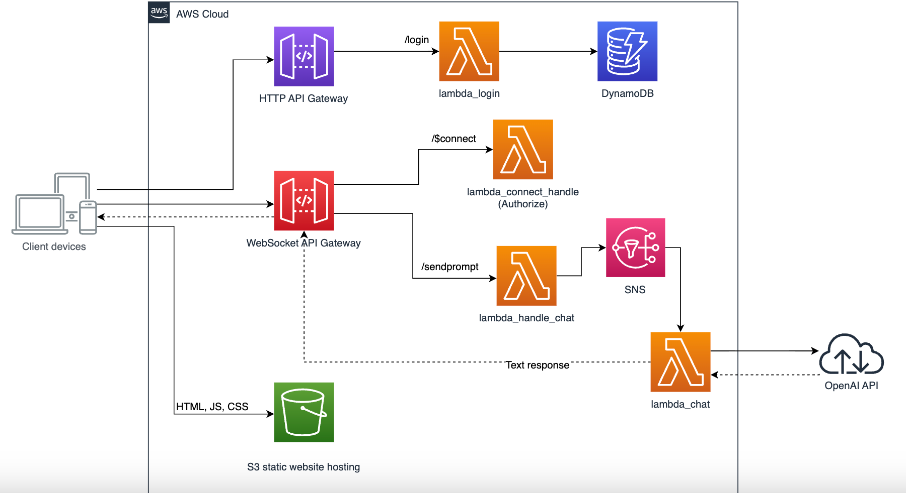


## Setup  
### Create Lambda functions
We will create 4 lambda functions: (Code files are in four sub folers under /server. 
1. **lambda_login**  
***Tips:***  
- This lambda is integrated with the ***/login*** route of HTTP API, and perform the user validation. 
- The execution role of this lambda requires read permission of DynamoDB tables. You need to attach the **DynamodDB access policy** accordingly
- Need to configure an environment variable named **TOKEN_KEY**.

1. **lambda_connect_handle**  
***Tips:***  
- This lambda is integrated with the ***$connect*** route of WebSocket API, and perform the token authorization. 
- Need to configure the same **TOKEN_KEY** environment variable as lambda_login.

3. **lambda_handle_chat**  
***Tips:***  
- This lambda is integrated with the ***sendprompt*** route of WebSocket API, and send the connectionId and the prompt from user input to a SNS.
- The execution role of this lambda requires SNS publish permission. You need to attach the SNS policy accordingly.
- Need to configure an environment variable named **SNS_TOPIC_ARN**, and fill the arn of your SNS topic ( Creation steps will be guided in later)

4. **lambda_chat**  
***Tips:***  
- This lambda is triggered by SNS, so it will subscribe SNS topic later.
- It calls OpenAI API to get the response text, and send back the text via the WebSocket API Gateway, so it needs to be attached with the permission policy of **AmazonAPIGatewayInvokeFullAccess**. 
- Change the lambda **timeout value**  to a bigger one, for example 5 mins.
- Configure your own OpenAI API key in environment variables as key named **"OPENAI_API_KEY"**.


## Create API gateway
1. Create the HTTP API gateway.  
   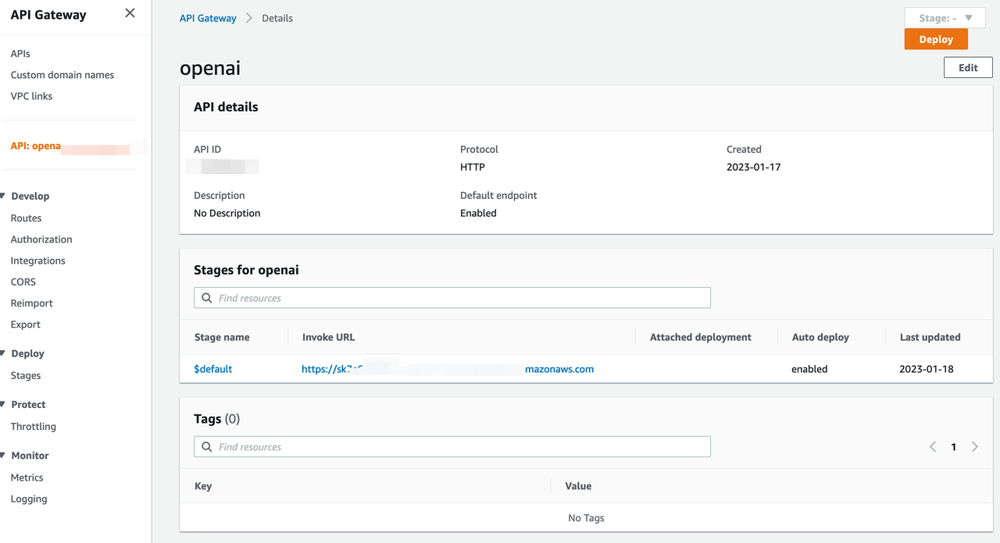
2. Create a Route using POST method:  /login***.
3. For ***/login*** route, we need to integrate to the Lambda function created for login. In Lambda function field, select the ***"openai-login"*** that you have created above.  
   5 Set the CORS configuration as below:  
   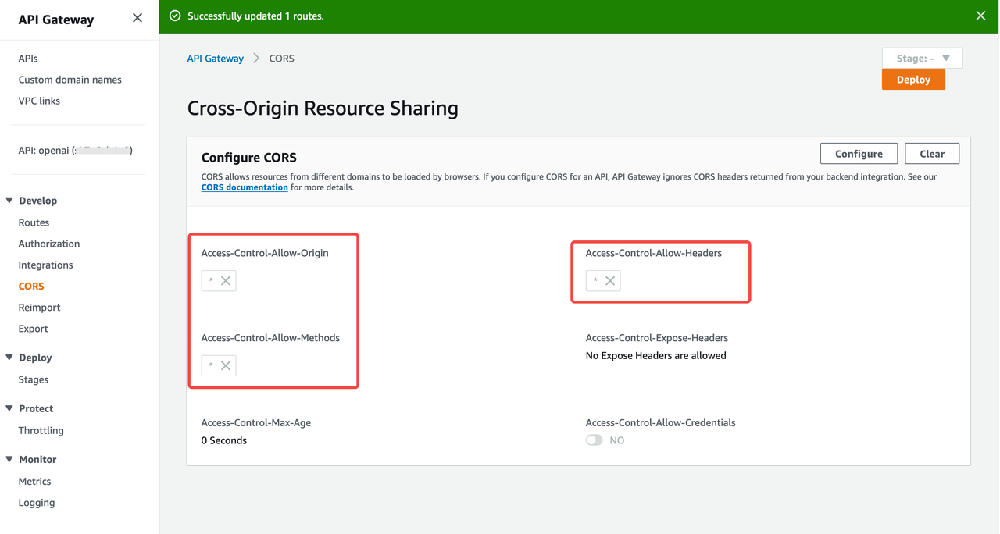

## Create DynamoDB table
We use Amazon DynamoDB to store username and password credentials. To simplify the demo, we will not implement the signup function, you can directly add the user and unencrypted password into the table. Or you can use the AWS CLI command in the code package.
1. Sign in to the AWS Management Console and open the Amazon DynamoDB console, create a table name ***chat_user_info*** with the partition key ***username***.
   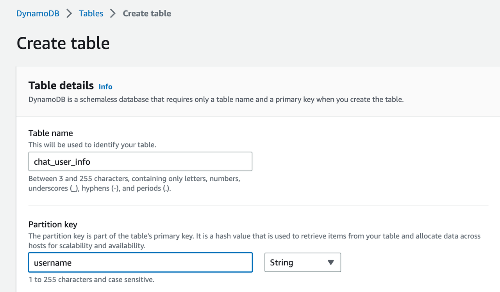.
2. Add your username and password pairs to the table.  
   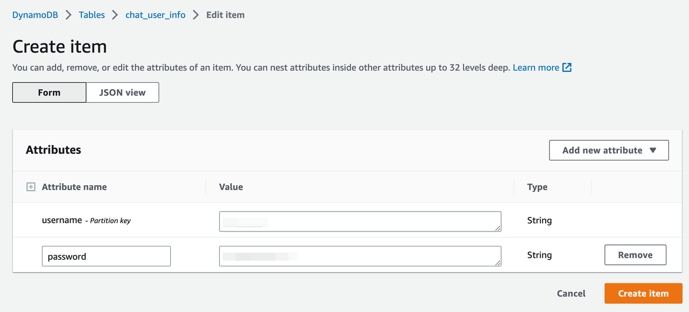.


## Host the website in S3
When you configure a bucket as a static website, you must enable static website hosting, configure an index document, and set the permissions. You can read the detail from **[AWS doc Reference](https://docs.aws.amazon.com/AmazonS3/latest/userguide/WebsiteHosting.html)**.
1. Create an S3 bucket named ***bucket-name*** on the Amazon S3 console.
2. Enable static website hosting of this bucket. In Index document, enter the file name of the index document `index.html`.
3. By default, the S3 bucket blocks public access. You need to change the setting by unchecking the option in the "Permissions" tab of the bucket detail page.
4.  Add the policy below to the bucket policy to allow public access.
    ```
    {
        "Version": "2012-10-17",
        "Statement": [
            {
                "Sid": "PublicReadGetObject",
                "Effect": "Allow",
                "Principal": "*",
                "Action": [
                   "s3:GetObject"
                ],
                "Resource": [
                   "arn:aws:s3:::bucket-name/*"
                ]
            }
        ]
    }
    ```
5.  Then your Amazon S3 website follows one of these two formats:
- http://bucket-name.s3-website-Region.amazonaws.com
- http://bucket-name.s3-website.Region.amazonaws.com

### Build the static files for client
1. In your local environment, go to the client folder, change the first line of apigw.js to the actual API gateway endpoint which you created in the previous step.
> const API_endpoint = 'https://xxx.amazonaws.com/';
2. Then run these commands to install and build the packages for the front-end website.  
   `>cd client`  
   `>npm install`  
   `>npm run build`
3. After the "npm run build" completes, it will create a folder named "build" in the client folder. That folder has all the files to be deployed to the Amazon S3 website. You can upload this folder to the bucket through AWS S3 console or use AWS CLI as below:  
   `>aws s3 sync ./build/ s3://bucket-name/
4. After all steps are done, now you can visit the S3 website endpoint in your PC/Mobile browser, and login the page with your username and password you stored in the DynamoDB table.


### Create a WebSocket API gateway  
1. Create a WebSocket API gateway from console  
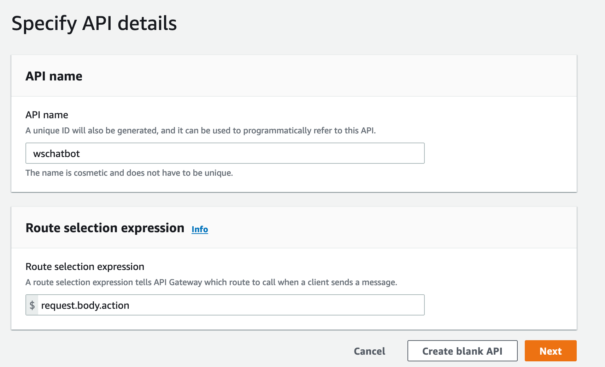
2. Add route key ***$connect*** and ***sendprompt***  
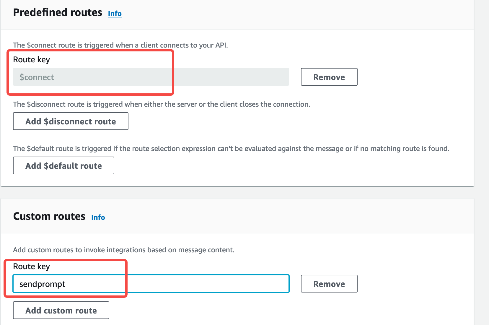
3. Add integration to the lambdas accordingly
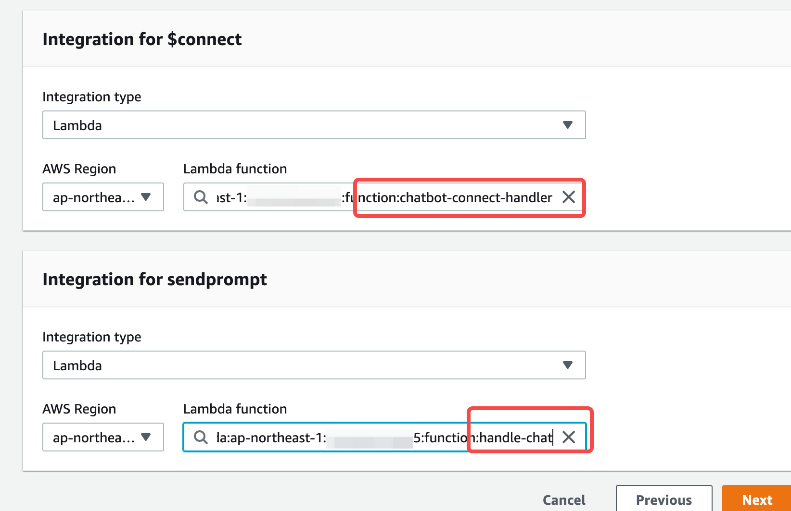
4. Get your WSS endpoint
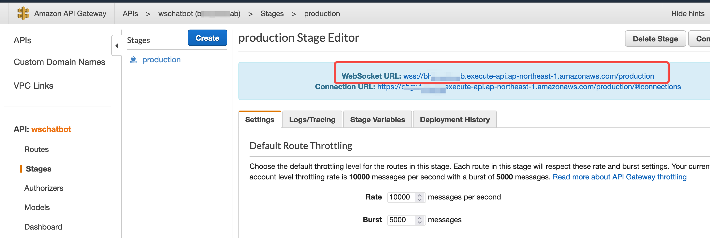


### Create SNS topic  
1. Create a ***Standard*** SNS topic  
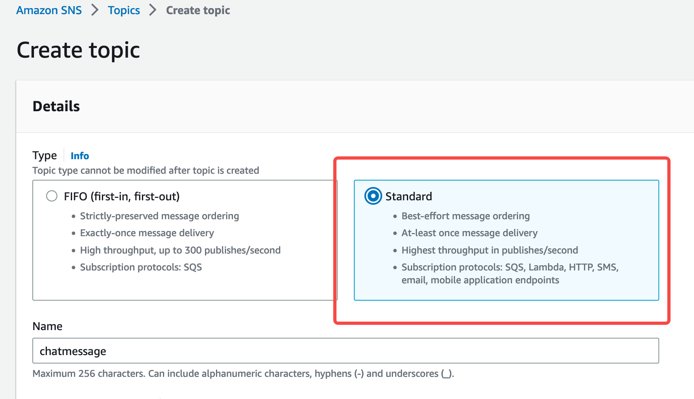
2. Create a subscription, choose lambda in policy field, and past your arn link of lambda_chat to the endpoint field.  
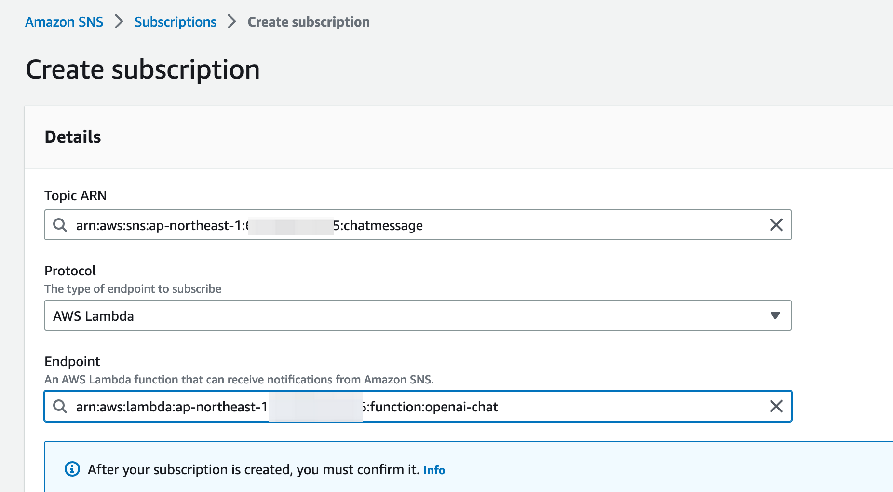
3. Copy the sns topic arn and paste to the environment variable's value of SNS_TOPIC_ARN of **lambda_handle_chat**
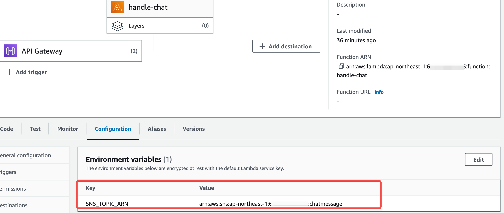

### Build the client
1. Change the API_http and API_socket in code [apigw.js](client/src/commons/apigw.js),  to your actual endpoints of HTTP API GW and WebSocket GW accordingly.
`export const API_socket = 'wss://{apiid}.execute-api.{region}.amazonaws.com/dev';`
`export const API_http = 'https://{apiid}.execute-api.{region}.amazonaws.com';` 

2. Run npm install and npm run build.
 

### Upload the static files to S3 bucket.
1. Setup the s3 bucket with static website hosting enable 
2. Upload the files in build folder to the bucket. 

## After all these done, Congrats!


